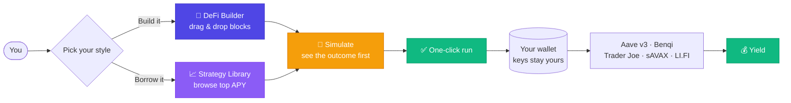

  

  <h1>Ocean Fin</h1>

  <strong>DeFi, minus the headache.</strong>

---

## 🌊 What is OceanFin?

DeFi yields are real. Chasing them usually isn't fun: you hop between five protocols, do math in a spreadsheet, and pray you didn't fat-finger a transaction.

OceanFin makes that whole dance disappear. Snap together a strategy like LEGO, or borrow one a pro already built, preview exactly what happens, then run it in **one click**. Your money never leaves your wallet. We don't hold your keys, ever.

> **Non-custodial. Data-driven. Built for Avalanche.**

---

## 🗺️ How it works

Two paths in, same happy ending: preview, click, earn.

---

## ✨ Two ways to earn

### 🧱 1. Build your own: the DeFi Builder

Think of it as a canvas for money moves. Drag operation blocks, snap them together, watch OceanFin figure out the plumbing.

- Drag-and-drop blocks: **Swap → Supply → Borrow → Loop → Bridge**
- Connect them however you like. Invalid combos get caught before you commit.
- Live prices and APY estimates update as you build
- Hit deploy, sign once, done

No Solidity. No spreadsheets. Just blocks.

👉 Find it at **`/builder`**

### 📈 2. Steal a good one: the Strategy Library

Not everyone wants to build from scratch. Browse strategies other people already tuned, sorted by what's actually paying the most right now.

- See the hottest APY at a glance
- Simulate the full outcome *before* a single dollar moves
- Like it? Run it in one click on your own wallet.

Great strategies, ready to borrow.

👉 Browse them right on the **home page**

---

## 🎯 Why people use it

- **Your keys, your coins.** Non-custodial, always.
- **No expert badge required.** The hard parts are handled for you.
- **Look before you leap.** Every strategy is simulated up front.
- **One click, not ten tabs.** No more manual protocol-hopping.
- **Room to grow.** Avalanche first, with Base and Arbitrum on the same rails.

---

## 🔌 What's under the hood

OceanFin plugs straight into the protocols people actually trust on Avalanche:

| You do | We route it through |
| ------ | ------------------- |
| Swap tokens | Trader Joe (LFJ) v2.2 |
| Earn on deposits | Aave v3, Benqi |
| Borrow against collateral | Aave v3, Benqi |
| Stake AVAX | sAVAX liquid staking |
| Cross chains | LI.FI |

Built with Next.js on the front, NestJS on the back, and viem/wagmi doing the on-chain talking. Wallets connect through RainbowKit (MetaMask, Core, WalletConnect).

---

## 🛠️ Where things stand

| Status | Feature |
| ------ | ------- |
| ✅ | Wallet connect &amp; account binding |
| ✅ | **DeFi Builder: visual strategy composer** |
| ✅ | **Strategy Library: browse, simulate, one-click run** |
| ✅ | Benqi looping (AVAX / sAVAX) |
| ✅ | Aave v3 supply &amp; borrow |
| ✅ | Activity tracking &amp; progress updates |

---

## 🗓️ What's next

### 🧩 More protocols on Avalanche

The builder is only as good as the blocks it can snap together. Next up, in rough order:

**Lending &amp; borrowing**

- [ ] **Aave v4** — new hub-and-spoke architecture, unified liquidity layer. Ship as soon as it lands on Avalanche mainnet.
- [ ] **Euler v2** — modular vaults (EVK/EVC), custom collateral pairs the big pools won't list
- [ ] **Silo Finance** — isolated risk markets, so a long-tail token can't drag down the rest
- [ ] **Morpho** — peer-to-peer matching layered on top of existing pools for a better rate on both sides
- [ ] **Delta Prime** — undercollateralized leverage on AVAX-native assets

**Yield &amp; auto-compounding**

- [ ] **Yield Yak** — auto-compounding vaults, the Avalanche default for "set and forget"
- [ ] **Beefy** — multi-strategy vaults, familiar to anyone coming from other chains
- [ ] **Pendle** — split yield from principal: PT/YT blocks unlock fixed-rate and yield-trading strategies
- [ ] **Steakhut** — concentrated-liquidity vaults managed for you

**DEX &amp; liquidity**

- [ ] **Pharaoh** and **Blackhole** — ve(3,3) DEXes where most new AVAX pairs bootstrap first
- [ ] **Curve** — stable and pegged-asset swaps with minimal slippage
- [ ] **Balancer** — weighted pools and boosted-pool routing
- [ ] **Uniswap v4** — hooks-based pools once liquidity migrates

**Liquid staking**

- [ ] **GoGoPool (ggAVAX)** — a second LST next to sAVAX, so looping isn't a one-horse race
- [ ] **Suzaku** — restaking / L1 security blocks as the Avalanche9000 L1s come online

Each protocol lands as a first-class builder block: same drag-and-drop, same simulate-before-you-sign, same one-click run.

### 🚀 Everything else

- [ ] Full protocol coverage on Base &amp; Arbitrum
- [ ] Withdraw strategies
- [ ] Agent-wallet execution (x402 protocol)
- [ ] Cross-chain bridging baked into every strategy
- [ ] More strategy templates
- [ ] Metrics &amp; monitoring dashboard

---

## ⚡ Get started

Ready to dive in?

👉 **[Quick Start Guide](./QUICK_START.md):** install, run locally, and take both features for a spin.

---

## 📬 Say hi

Questions, feedback, or ideas? Ping us on [Telegram](https://web.telegram.org/k/#@mtd_71).

---

  <strong>OceanFin: navigate DeFi with confidence.</strong>

