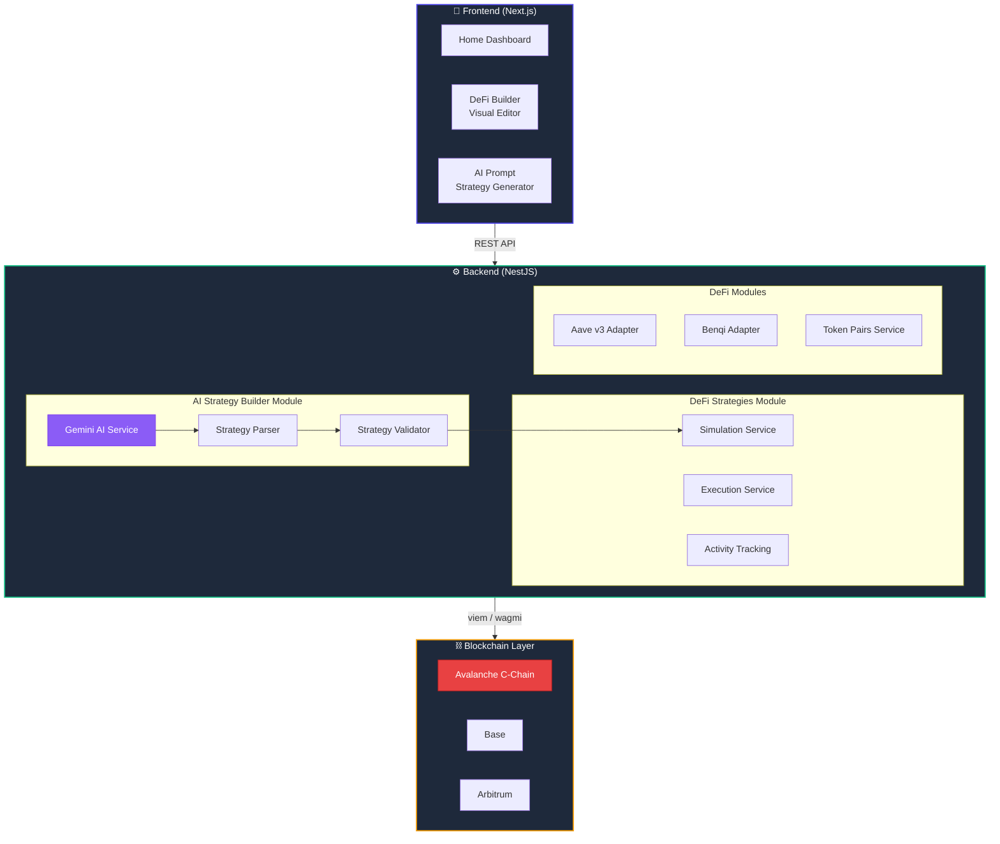
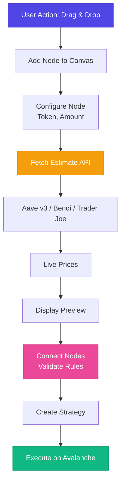
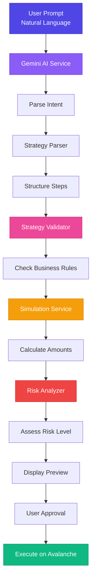

  

  <h1>Ocean Fin</h1>

# About OceanFin

**Optimizing Avalanche DeFi Earnings**

OceanFin is a non-custodial platform that maximizes your Avalanche DeFi earnings with automated, data-driven strategies—no middlemen, just high-yield opportunities.

---

## 🚀 Features

* **Non-custodial:** Users retain 100% control of assets
* **DeFi Builder:** Visual drag-and-drop interface for composing complex strategies
* **AI-Powered Strategy Generation:** Create strategies from natural language prompts
* **One-Click Execution:** Eliminate manual protocol hopping and spreadsheet math
* **Real-time Simulation:** Preview strategy outcomes before execution
* **Transparent & Secure:** Full visibility into strategies and execution
* **Multi-chain Ready:** Avalanche C-Chain first, with Base and Arbitrum on the same EVM rail

---

## 🎯 Core Objectives

* Make DeFi simple and accessible—no expert knowledge required
* Keep assets fully under user control
* Automate strategy discovery and execution
* Provide clear, real-time activity tracking
* Enable seamless cross-chain operations

---

## 🎨 Key Features

### DeFi Builder - Visual Strategy Composer

Build complex DeFi strategies with a drag-and-drop interface. No coding required.

**Key Features:**
* Visual workflow canvas powered by ReactFlow
* Drag-and-drop operation nodes (SWAP, SUPPLY, BORROW, JOIN_STRATEGY, BRIDGE)
* Smart connection validation with business rules
* Real-time price estimation and APY calculations
* Interactive configuration panels
* One-click strategy deployment

**Supported Operations:**
* `SWAP` - Exchange tokens via Trader Joe (LFJ) v2.2
* `SUPPLY` - Deposit tokens to Aave v3 or Benqi markets
* `BORROW` - Borrow tokens against collateral
* `JOIN_STRATEGY` - Convert AVAX to liquid staking derivatives (sAVAX)
* `BRIDGE` - Move assets across chains via LI.FI

**Access:** Navigate to `/builder` in the app

---

### AI Prompt to Strategy

Generate executable DeFi strategies from natural language using Google Gemini AI.

**How it works:**
1. Describe your strategy in plain English
2. AI generates a complete strategy with validation
3. Review the visual preview and risk analysis
4. Execute with one click

**Example Prompts:**
* "Loop sAVAX three times to compound the staking yield"
* "Supply AVAX as collateral and borrow USDC against it"
* "Route idle USDC into the highest paying lending market"

**Features:**
* Natural language processing with Gemini AI
* Automatic strategy validation
* Real-time simulation with accurate amounts
* AI-powered risk analysis
* Interactive strategy preview

**Access:** Navigate to `/prompt` in the app

---

## 🏗️ Architecture

### System Overview

### Data Flow

#### 1. DeFi Builder Flow

#### 2. AI Prompt to Strategy Flow

### Key Components

**Frontend:**
- **ReactFlow Canvas:** Visual workflow editor for DeFi Builder
- **AI Prompt Interface:** Natural language input for strategy generation
- **Strategy Preview:** Interactive visualization of generated strategies
- **Wallet Integration:** RainbowKit + wagmi (MetaMask, Core, WalletConnect)

**Backend:**
- **AI Strategy Builder:** Gemini AI integration for NLP
- **Strategy Simulation:** Accurate amount calculations with live prices
- **DeFi Modules:** Protocol integrations (Aave v3, Benqi, Trader Joe, LI.FI)
- **Validation Engine:** Business rules enforcement

**Blockchain:**
- **Avalanche C-Chain (43114):** Primary network — Aave v3, Benqi, Trader Joe v2.2
- **Base (8453) & Arbitrum (42161):** Aave v3 markets on the same EVM rail
- **Smart Contracts:** Aave v3 Pool, Benqi comptroller/qiTokens, sAVAX, LFJ router

### Technology Stack by Layer

| Layer          | Technologies                                       |
| -------------- | -------------------------------------------------- |
| **Frontend**   | Next.js 14, React 18, TypeScript, Tailwind CSS     |
| **UI Library** | ReactFlow, Radix UI, Framer Motion, shadcn/ui      |
| **Backend**    | NestJS, TypeScript, Clean Architecture (DDD)       |
| **Database**   | Supabase (PostgreSQL)                              |
| **AI**         | Google Gemini AI (gemini-1.5-pro)                  |
| **Blockchain** | viem, wagmi, Aave v3, Benqi, Trader Joe, LI.FI     |
| **Wallets**    | RainbowKit (MetaMask, Core, WalletConnect)         |
| **DevOps**     | Railway, GitHub Actions, Docker (planned)          |

---

## 📦 Tech Stack

* **Frontend:** Next.js, React, Tailwind CSS, TypeScript, ReactFlow
* **Backend:** NestJS, Supabase
* **AI:** Google Gemini AI (gemini-1.5-pro)
* **Blockchain:** Avalanche C-Chain via viem/wagmi; Aave v3, Benqi, Trader Joe v2.2, LI.FI
* **Wallets:** EVM wallets through RainbowKit (MetaMask, Core, WalletConnect)
* **Automation:** Agent wallet, strategy simulation

---

## 🛠️ Current Status

| Status | Feature                                     |
| ------ | ------------------------------------------- |
| ✅      | EVM wallet connect & account binding        |
| ✅      | Benqi looping strategies (AVAX / sAVAX)     |
| ✅      | Strategy simulation & execution             |
| ✅      | Activity tracking & progress updates        |
| ✅      | Aave v3 supply & borrow on Avalanche        |
| ✅      | **DeFi Builder - Visual strategy composer** |
| ✅      | **AI Prompt to Strategy with Gemini AI**    |

---

## 🗓️ Roadmap

* [x] Stable Dapp
* [x] DeFi protocols on Avalanche (Aave v3, Benqi, Trader Joe)
* [x] **DeFi Builder - Visual workflow editor**
* [x] **AI-Powered Strategy Generation**
* [ ] Full protocol coverage on Base
* [ ] Full protocol coverage on Arbitrum
* [ ] Withdraw Strategies
* [ ] Executing by Agent Wallet (x402 Protocol)
* [ ] Cross-chain bridging via LI.FI in every strategy
* [ ] More Strategies
* [ ] Metrics and Monitors
* [ ] Apply Grants

---

## ⚡ Getting Started

Ready to dive in? Check out our comprehensive setup guide:

👉 **[Quick Start Guide](./QUICK_START.md)** - Complete installation and setup instructions

**What you'll find:**
- Prerequisites and environment setup
- Step-by-step installation guide
- Local development server configuration
- Usage examples for DeFi Builder and AI Prompt
- Troubleshooting common issues

## 📬 Contact

For questions, feedback, or contributions, please reach out via [Telegram](https://web.telegram.org/k/#@mtd_71).

---

**OceanFin — Navigate DeFi with confidence.**
